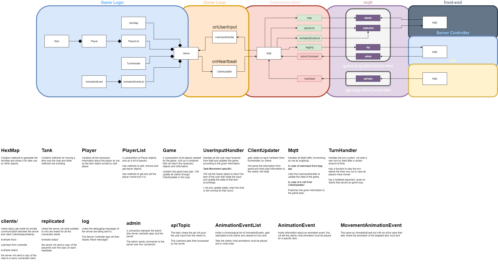

# game-server

Server of the BUG game.

## layout of server


## running the server

1. Change the name of the broker at mqttconfig.json to mqtt://<YOUR_IP_ADDRESS>

2. Run `npm start` in the root directory.

### connecting as client

You can connect to the broker through mqttbox for troubleshooting (protocol : mqtt / tcp, host: <IP_OF_DEVICE_RUNNING_THE_BROKER>)

topics of interest:
-`game/logs` : Where the server places logging messages.
-`game/replicated` : Where the server places information meant for all clients.
-`game/clients/*` : Where the server places information meant for one specific client.

### imitating client

to imitate a potential client you will have to send a message to `game/` in the following format:
```json
{
  "Player": {
    "username": "playerName",
    "movement": "movement_type",
    "dev_id": "",
    "action": "A",
    "joined": true
  },
  "Controller": { "addons": [null, null, null], "dev_id": "" }
}
```

The movement input of the first packet will be ignored while the server is adding you as a new player.


### configuring the environment variables

To configure enviroment variables, place a .env file inside the root directory of the server. An example configuration could look like this:
```
#MQTT settings
GAME_BROKER=wss://game.bug.labict.be/broker
GAME_TOPIC=game64

API_BROKER=wss://api.bug.labict.be/broker
API_TOPIC=game64

#Local backup broker port
PORT=443

#map settings
WIDTH=22
HEIGHT=17
TILE_SIZE=40

#game settings
TURN_LENGTH=5
HEARTBEAT=1000
```
Each of these values can be excluded from the file, the server will then fall back to a default value configured inside the files in the configuration directory.